## <b> 📈 1. KPI & Aggregation Analysis

### <b> Q1 </b>

#### *Management wants a five-year performance summary. Calculate total revenue, total units sold, total purchase cost, total gross profit, and gross margin percentage.*

``` python

value_calculation = rice.copy()

value_calculation["Total_Sales"] = value_calculation["Per Unit Price (INR)"] * value_calculation["Unit Sold"]

value_calculation["Total_Purchase"] = value_calculation["Purchase Cost (INR)"] * value_calculation["Unit Sold"]

value_calculation["Profit"] = value_calculation["Total_Sales"] - value_calculation["Total_Purchase"]

a = value_calculation["Total_Sales"].sum()

b = value_calculation["Total_Purchase"].sum()

c = value_calculation["Profit"].sum()

d = value_calculation["Unit Sold"].sum()

e = (c / a) * 100
e = f"{e:.2f} %"

final_calculation = pd.Series(
    [a, d, b, c, e],
    index=["Total Revenue",
    "Total Units Sold",
    "Total Purchase Cost",
    "Total Gross Profit",
    "Gross Margin Percentages"]
)

final_calculation

```

## 📷 Output

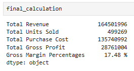

---

### <b> Q2 </b>

#### *Which locations generated the highest total revenue during the five-year period?*

``` python

top_revenue = rice

column_seperation = top_revenue[["Year", "Location", "Unit Sold", "Per Unit Price (INR)"]]

column_seperation["Total_Sales"] = column_seperation["Per Unit Price (INR)"] * column_seperation["Unit Sold"]

store_finding = column_seperation.groupby(["Location"])["Total_Sales"].sum()

store_finding.sort_values(inplace= True, ascending= False)

store_finding.head(1)

```

## 📷 Output

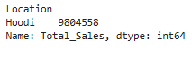

---

### <b> Q3 </b>

#### *Compare the seven product categories based on revenue, units sold, gross profit, and gross margin.*

``` python

product_category = rice

product_category["Product Category"].unique()

product_category["Total_Sales"] = product_category["Per Unit Price (INR)"] * product_category["Unit Sold"]

product_category["Total_pur"] = product_category["Purchase Cost (INR)"] * product_category["Unit Sold"]

product_category["Profit"] = product_category["Total_Sales"] - product_category["Total_pur"]

pro_calculation = product_category.groupby("Product Category").agg({
    "Total_Sales" : "sum",
    "Unit Sold" : "sum",
    "Profit" : "sum",
})

pro_calculation.sort_values(by=["Total_Sales", "Profit"], inplace=True, ascending=False)

pro_calculation["Gross_Margin"] = (pro_calculation["Profit"] / pro_calculation["Total_Sales"]) * 100

pro_calculation["Gross_Margin"] = pro_calculation["Gross_Margin"].map(lambda x: f"{x :.2f} %")

pro_calculation

```

## 📷 Output

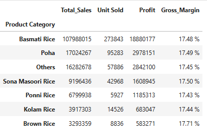

---

### <b> Q4 </b>

#### *Which months generated the highest and lowest total revenue?*

``` python

months_values = rice

months_values.head()

months_values["month_names"] = months_values["Date"].dt.month_name()

months_values["Total_Sales"] = months_values["Per Unit Price (INR)"] * months_values["Unit Sold"]

Values_seperation = months_values[["month_names", "Total_Sales"]]

month_result = Values_seperation.groupby("month_names")["Total_Sales"].sum()

month_result.sort_values(inplace=True, ascending=False)

month_result

```

## 📷 Output

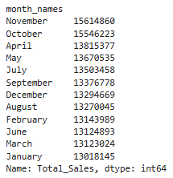
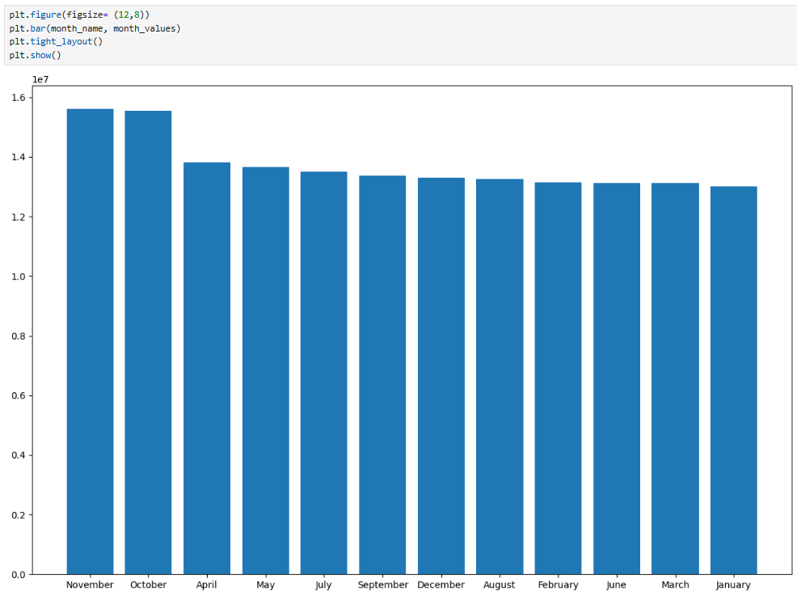

---

### <b> Q5 </b>

#### *Which brands generated the highest total units sold?*

``` python

brand = rice
brand_calculation = brand.groupby("Rice Brand")["Unit Sold"].sum().sort_values(ascending= False)
brand_calculation

```

## 📷 Output

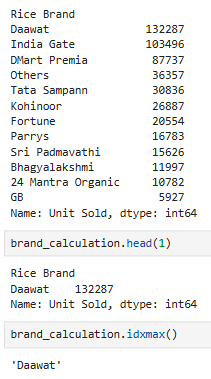

---

### <b> Q6 </b>

#### *Calculate the average revenue generated per product across the complete dataset.*

``` python

product_average = rice.copy()
product_average["Total_Revenue"] = product_average["Per Unit Price (INR)"] * product_average["Unit Sold"]
product_average.groupby("Product Name")["Total_Revenue"].mean().sort_values(ascending= False)

```

## 📷 Output

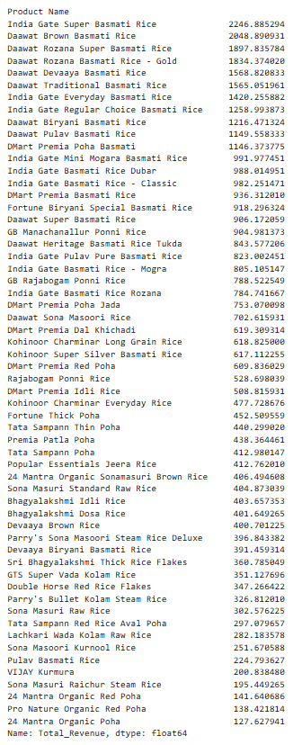

---

### <b> Q7 </b>

#### *Which locations have above-average revenue but below-average gross margin?*

``` python

avg_margin_cal = rice.copy()

avg_margin_cal["Revenue"] = avg_margin_cal["Per Unit Price (INR)"] * avg_margin_cal["Unit Sold"]

avg_margin_cal["Total_Purchase"] = avg_margin_cal["Purchase Cost (INR)"] * avg_margin_cal["Unit Sold"]

avg_margin_cal["Profit"] = avg_margin_cal["Revenue"] - avg_margin_cal["Total_Purchase"]

avg_margin_cal.head(2)

avg_group = avg_margin_cal.groupby("Location")["Revenue"].sum()

avg_calculation = pd.DataFrame(avg_group)

avg_calculation["Revenue_Average"] = avg_calculation["Revenue"].mean()

avg_calculation["Revenue_Segment"] = avg_calculation["Revenue"].map(lambda x : "Above Average" if x > 967658 else "Below Average")

margin_group = avg_margin_cal.groupby("Location")["Profit"].sum()

mar_calculation = pd.DataFrame(margin_group)

margin_cal = pd.merge(avg_calculation, mar_calculation, on="Location")

margin_cal["Margin"] = (margin_cal["Profit"] / margin_cal["Revenue"]) * 100

margin_cal["Margin_Average"] = margin_cal["Margin"].mean()

margin_cal["Margin_Segment"] = margin_cal["Margin"].apply(lambda x : "Above_Margin" if x > 17.483498 else "Below_Margin")

margin_cal

margin_cal[(margin_cal["Revenue_Segment"] == "Above Average") & (margin_cal["Margin_Segment"] == "Below_Margin")]

```

## 📷 Output

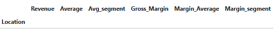

---

### <b> Q8 </b>

#### *For each package size, calculate revenue, units sold, gross profit, and average selling price.*

``` python

package_size = avg_margin_cal.copy()

package_calculation = package_size.groupby("Product Quantity").agg({
    "Revenue" : "sum",
    "Unit Sold" : "sum",
    "Profit" : "sum",
})

package_calculation.rename(columns=
    {
        "Revenue" : "Total Revenue",
        "Unit Sold" : "Unit Sold",
        "Profi" : "Total Profit"
    }, inplace= True
)

package_calculation["average selling price"] = (package_calculation["Total Revenue"] / package_calculation["Unit Sold"]).round()

package_calculation

```

## 📷 Output

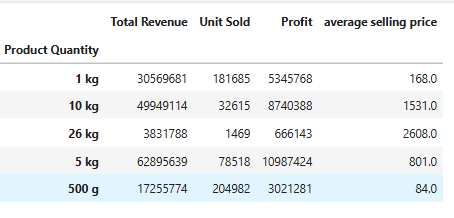

---

## <b> 📈 2. Conditional & Category-Based Analysis

### <b> Q9 </b>

#### *Classify products into High, Medium, and Low profitability based on gross margin. Compare the revenue generated by each group.*

``` python

hm1_profit = rice.copy()

hm1_profit.head(2)

pro_seperate = hm1_profit.groupby("Product Name")[["Sales", "Profit"]].sum()

pro_seperate["Gross_margin"] = (pro_seperate["Profit"] / pro_seperate["Sales"]) * 100

pro_seperate.sort_values(by=["Gross_margin"], ascending=False, inplace=True)

def prof(par):
    if par >= 17.6:
        return "High Profitability"

    elif par >= 17.4:
        return "Medium Profitability"

    else:
        return "Low Profitability"

pro_seperate["Profitability"] = pro_seperate["Gross_margin"].apply(prof)

pro_seperate

pro_seperate.groupby("Profitability")["Sales"].sum().sort_values(ascending=False)

```

## 📷 Output

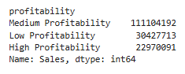

---

### <b> Q10 </b>

#### *Identify products that have high sales volume but below-average gross margin.*

``` python

high_Sales = rice.copy()

average_cal = high_Sales.groupby("Product Name")[["Sales", "Unit Sold", "Profit"]].sum()

pro_average = average_cal["Sales"].mean().round()

pro_average

average_cal["Product_avg"] = np.where(average_cal["Sales"] > pro_average, "High_Sales", "Low_Sales")

average_cal.sort_values(by="Product_avg", inplace=True)

average_cal["Gross_Margin"] = (average_cal["Profit"] / average_cal["Sales"]) * 100

average_cal["Avg_Margin"] = average_cal["Gross_Margin"].mean()

average_cal["Margin_Segment"] = average_cal["Gross_Margin"].apply(lambda x : "Above Avg" if x > 17.483551 else "Below Avg")

average_cal[(average_cal["Product_avg"] == "High_Sales") & (average_cal["Margin_Segment"] == "Below Avg")]

```

## 📷 Output

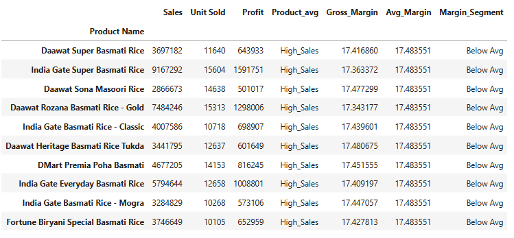

---

### <b> Q11 </b>

#### *Identify locations that have above-average revenue but below-average units sold.*

``` python

location_avg_unit = rice.copy()

loc_sales_avg = location_avg_unit.groupby("Location")[["Sales", "Unit Sold"]].sum()

loc_sales_avg["Sales_Avg"] = loc_sales_avg["Sales"].mean()

loc_sales_avg["Sales_segment"] = loc_sales_avg["Sales"].apply(lambda x : "Above Avg" if x > 9676588.0 else "Below Avg")

loc_sales_avg["Unit_sold_Avg"] = loc_sales_avg["Unit Sold"].mean()

loc_sales_avg["Sold_segment"] = loc_sales_avg["Unit Sold"].apply(lambda x : "Above Avg" if x > 29368.764706 else "Below Avg")

loc_sales_avg[(loc_sales_avg["Sales_segment"] == "Above Avg") & (loc_sales_avg["Sold_segment"] == "Below Avg")]

```

## 📷 Output

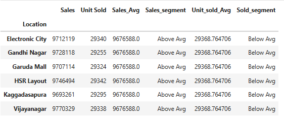

---

### <b> Q12 </b>

#### *Identify products whose selling price is at least 20% higher than their purchase cost.*

``` python

hike_20 = rice

get_unique = hike_20[["Product Name", "Product Quantity", "Purchase Cost", "Unit Price"]]

get_unique = get_unique.drop_duplicates(subset=["Product Name", "Product Quantity"])

get_unique["twenty_cal"] = get_unique["Purchase Cost"] + ((get_unique["Purchase Cost"] / 100) * 20)

get_unique["twenty_logics"] = get_unique["Unit Price"] - get_unique["twenty_cal"]

get_unique["twenty_segment"] = get_unique["twenty_logics"].apply(lambda x : "Higher" if x >= 0 else "Lower")

get_unique[get_unique["twenty_segment"] == "Higher"]

```

## 📷 Output

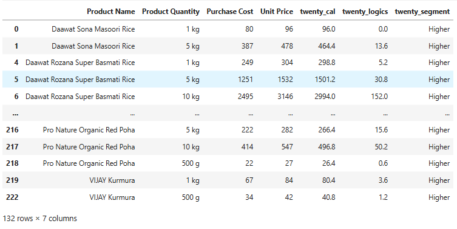

---

### <b> Q13 </b>

#### *Management wants products that satisfy both conditions:*

#### *• above-average units sold*

#### *• above-average gross profit*

``` python

both_con = rice.copy()

unit_pro = both_con.groupby("Product Name")[["Unit Sold", "Profit", "Sales"]].sum()

unit_pro["Unit_avg"] = unit_pro["Unit Sold"].mean().round()

unit_pro["Unit_segment"] = unit_pro["Unit Sold"].apply(lambda x : "Above Avg" if x > unit_pro["Unit Sold"].mean() else "Below Avg")

unit_pro["profi_avg"] = unit_pro["Profit"].mean().round()

unit_pro["Profit_segment"] = unit_pro["Profit"].apply(lambda x : "Above Avg" if x > unit_pro["Profit"].mean() else "Below Avg")

unit_pro[(unit_pro["Unit_segment"] == "Above Avg") & (unit_pro["Profit_segment"] == "Above Avg")]

```

## 📷 Output

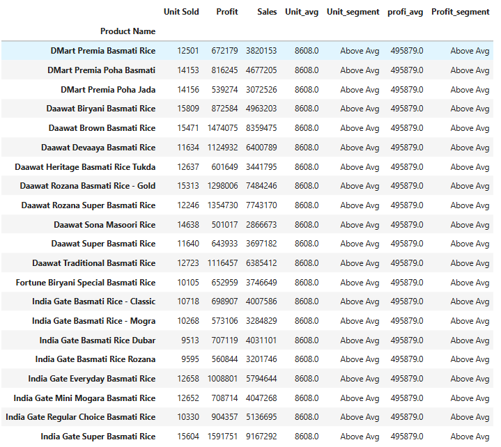

---

### <b> Q14 </b>

#### *Identify brands that generate high revenue but have relatively weak profitability.*

``` python

high_week = rice

avg_cal = high_week.groupby("Rice Brand")[["Sales", "Profit"]].sum()

avg_cal["Sales"].mean()

avg_cal["Sales_segment"] = np.where(avg_cal["Sales"] > avg_cal["Sales"].mean(), "High_Revenue", "Low_Revenue")

avg_cal["Gross_margin"] = (avg_cal["Profit"] / avg_cal["Sales"]) * 100

avg_cal["Gross_margin"].mean()

avg_cal["profit_segment"] = np.where(avg_cal["Gross_margin"] > avg_cal["Gross_margin"].mean(), "High_Profit", "Week_Profit")

avg_cal[(avg_cal["Sales_segment"] == "High_Revenue") & (avg_cal["profit_segment"] == "Week_Profit")]

```

## 📷 Output

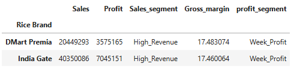

---

## <b> 📈 3. Top / Bottom Performer Analysis

### <b> Q15 </b>

#### *Identify the top 10 products by total revenue.*

``` python

top_10 = rice.copy()

top_10.groupby("Product Name")["Sales"].sum().sort_values(ascending= False).head(10)

```

## 📷 Output

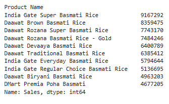

---

### <b> Q16 </b>

#### *Identify the top five brands by total gross profit.*

``` python

top_5_profit = rice.groupby("Rice Brand")["Profit"].sum().sort_values(ascending= False).head(5)

top_5_profit

```

## 📷 Output

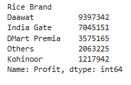

---

### <b> Q17 </b>

#### *For every product category, identify the top three products by revenue.*

``` python

top_3 = rice.copy()

first_way = top_3.groupby(["Product Category", "Product Name"])["Sales"].sum().groupby(level= 0).nlargest(3)

```

## 📷 Output

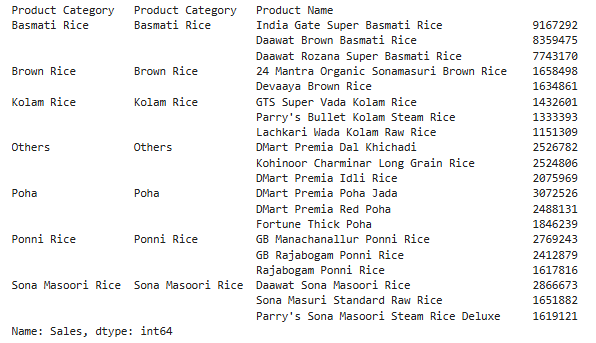

``` python

sec_way = top_3.groupby(["Product Category", "Product Name"])["Sales"].sum().reset_index()

sec_way.sort_values(by= ["Product Category", "Sales"], ascending= False).groupby("Product Category").head(3)

```

## 📷 Output

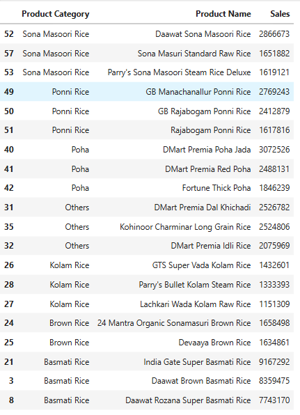

---

### <b> Q18 </b>

#### *For every location, identify the top three products by units sold.*

``` python

top_3_unit = rice.copy()

top_3_unit.groupby(["Location", "Product Name"])["Unit Sold"].sum().groupby(level= 0).nlargest(3)

top_3_sec_app = top_3_unit.groupby(["Location", "Product Name"])["Unit Sold"].sum().reset_index()

top_3_sec_app.sort_values(by= ["Location", "Unit Sold"], ascending= False).groupby("Location").head(3)

```

## 📷 Output

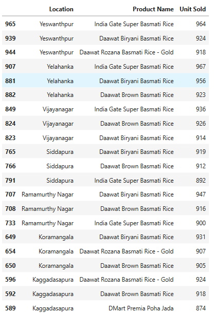

---

### <b> Q19 </b>

#### *Identify the bottom 10 products by gross profit.*

``` python

rice.groupby("Product Name")["Profit"].sum().sort_values(ascending= False).tail(10)

```

## 📷 Output

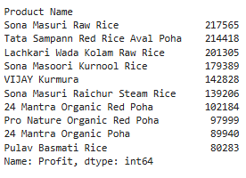

---

### <b> Q20 </b>

#### *Identify the five locations with the lowest revenue.*

``` python

rice.groupby("Location")["Sales"].sum().sort_values(ascending= True).head(5)

```

## 📷 Output

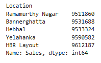

---

### <b> Q21 </b>

#### *Identify the top three brands within every location.*

``` python

top_3_brand = rice.copy()

rice.groupby(["Location", "Rice Brand"])["Sales"].sum().groupby(level= 0).nlargest(3)

```

## 📷 Output

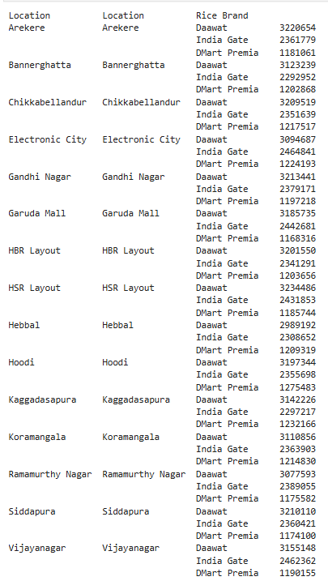

---

### <b> Q22 </b>

#### *Which products rank among the top performers based on both revenue and gross profit?*

``` python

rev_pro = rice.copy()

avg_cal_1 = rev_pro.groupby("Product Name")[["Sales", "Profit"]].sum()

avg_cal_1["Sales_Avg"] = np.where(avg_cal_1["Sales"] > avg_cal_1["Sales"].mean(), "top_Performance", "Not")

avg_cal_1["Profit_Avg"] = np.where(avg_cal_1["Profit"] > avg_cal_1["Profit"].mean(), "top_Performance", "Not")

value_sort = avg_cal_1[ (avg_cal_1["Sales_Avg"] == "top_Performance") & (avg_cal_1["Profit_Avg"] == "top_Performance")]

value_sort.sort_values(by= ["Sales", "Profit"],ascending= False)

```

## 📷 Output

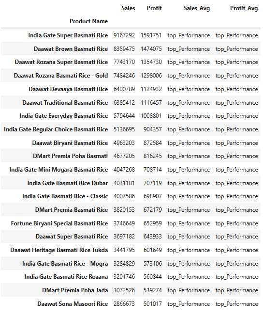

---

## <b> 📈 4. Period-over-Period Comparison

### <b> Q23 </b>

#### *Calculate month-over-month revenue growth for the entire business.*

#### *Identify the months with the largest increase and largest decline.*

``` python

mom_com = rice.copy()

mom_com["Month_name"] = mom_com["Date"].dt.month_name()

month_cal = mom_com.groupby(["Year", "Month_name", "Month"])[["Sales"]].sum()

month_cal.sort_values(by=["Year", "Month"], inplace=True)

month_cal["Month_shift"] = month_cal["Sales"].shift(1)

month_cal["MOM"] = ((month_cal["Sales"] - month_cal["Month_shift"]) / month_cal["Month_shift"]) * 100

```

## 📷 Output

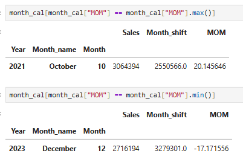

---

### <b> Q24 </b>

#### *Compare each location's monthly revenue with its previous month and identify locations experiencing significant declines.*

``` python

sig_dec = rice.copy()

sig_dec["Month Name"] = sig_dec["Date"].dt.month_name()

val_group = sig_dec.groupby(["Location", "Year", "Month Name", "Month"])["Sales"].sum()

val_frame = pd.DataFrame(val_group)

val_frame = val_frame.sort_values(by=["Location", "Year", "Month"])

val_frame["Previous Month"] = val_frame.groupby("Location")["Sales"].shift(1)

val_frame["pre_mon_Diff"] = val_frame["Sales"] - val_frame["Previous Month"]

val_frame["pre_mon_segment"] = val_frame["pre_mon_Diff"].apply(lambda x : "significant declines" if x < -50000 else "Not")

val_frame[val_frame["pre_mon_segment"] == "significant declines"]

```

## 📷 Output

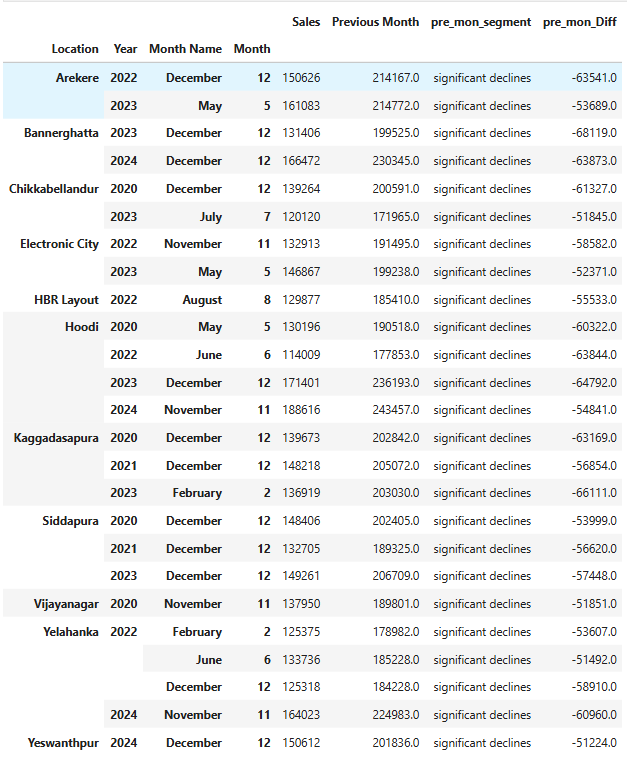

---

### <b> Q25 </b>

#### *Calculate year-over-year revenue growth for each product category.*

``` python

yoy_frame = rice.copy()

yoy_cal = pd.DataFrame(yoy_frame.groupby(["Product Category", "Year"])["Sales"].sum())

yoy_cal["pre_year_com"] = yoy_cal.groupby("Product Category")["Sales"].shift(1)

yoy_cal["pre_year_diff"] = ((yoy_cal["Sales"] - yoy_cal["pre_year_com"]) / yoy_cal["pre_year_com"]) * 100

yoy_cal["YOY"] = yoy_cal["pre_year_diff"].map(lambda x : f"{x :.2f} %")

yoy_cal

```

## 📷 Output

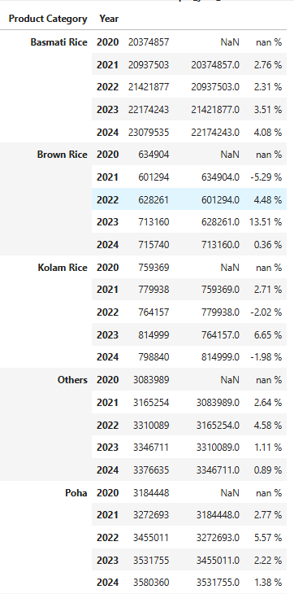

---

### <b> Q26 </b>

#### *Identify product categories whose units sold declined compared with the previous month.*

``` python

pro_cat_dec = rice.copy()

pro_cat_dec["Month_name"] = pro_cat_dec["Date"].dt.month_name()

pro_frame = pd.DataFrame(pro_cat_dec.groupby(["Product Category", "Year", "Month_name", "Month"])["Unit Sold"].sum())

pro_cal = pro_frame.sort_values(by=["Product Category", "Year", "Month"])

pro_cal["Pre_Month"] = pro_cal.groupby("Product Category")["Unit Sold"].shift(1)

pro_cal["month_diff"] = pro_cal["Unit Sold"] - pro_cal["Pre_Month"]

pro_cal[pro_cal["month_diff"] < 0]

```

## 📷 Output

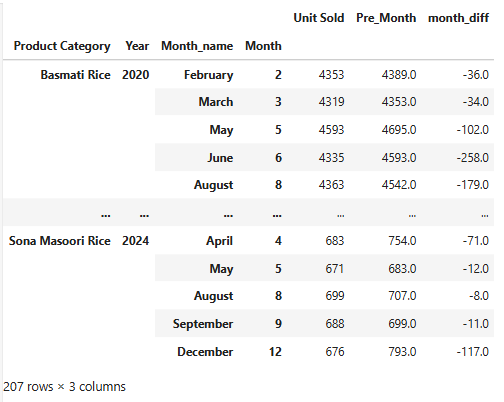

---

### <b> Q27 </b>

#### *Identify products whose revenue declined for at least two consecutive months.*

``` python

two_con = rice.copy()

two_con["month_name"] = two_con["Date"].dt.month_name()

two_con_frame = pd.DataFrame(two_con.groupby(["Product Name", "Year", "month_name", "Month"])["Sales"].sum())

two_con_gro = two_con_frame.sort_values(by=["Product Name", "Year", "Month"])

two_con_gro["pre_month"] = two_con_gro.groupby("Product Name")["Sales"].shift(1)

two_con_gro["difference"] = two_con_gro["Sales"] - two_con_gro["pre_month"]

two_con_gro["Diff_shift"] = two_con_gro.groupby("Product Name")["difference"].shift(1)

two_con_gro[(two_con_gro["difference"] < 0) & (two_con_gro["Diff_shift"] < 0)]

```

## 📷 Output

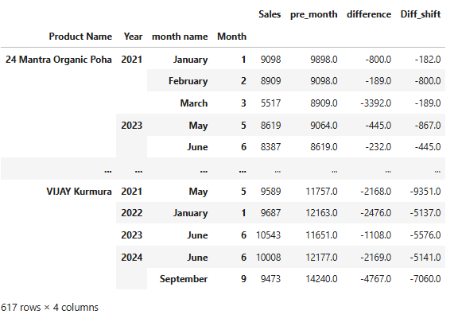

---

### <b> Q28 </b>

#### *Identify locations that show a consistent improvement in revenue over multiple periods.*

``` python

con_imp = rice.copy()

con_imp["Month_name"] = con_imp["Date"].dt.month_name()

con_imp_frame = pd.DataFrame(con_imp.groupby(["Location", "Year"])["Sales"].sum())

con_imp_frame["Pre_Year"] = con_imp_frame.groupby("Location")["Sales"].shift(1)

con_imp_frame["Difference"] = con_imp_frame["Sales"] - con_imp_frame["Pre_Year"]

con_imp_frame["shift_Diff"] = con_imp_frame.groupby("Location")["Difference"].shift(1)

con_imp_frame[(con_imp_frame["Difference"] > 0) & (con_imp_frame["shift_Diff"] > 0)]

```

## 📷 Output

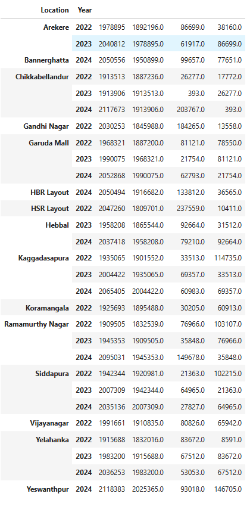

---

### <b> Q29 </b>

#### *Compare the first year and the final year of the dataset. Which categories improved the most?*

``` python

first_last = rice.copy()

fir_las_frame = pd.DataFrame(first_last.groupby(["Product Category", "Year"])["Sales"].sum())

fir_las_com = fir_las_frame.sort_values(by=["Product Category", "Year"], ascending=True)

fir_las_com["shift"] = fir_las_com.groupby("Product Category")["Sales"].shift(4)

fir_las_com["Diff"] = fir_las_com["Sales"] - fir_las_com["shift"]

fir_las_com.sort_values(by="Diff", ascending=False).head(1)

```

## 📷 Output

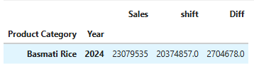

---

### <b> Q30 </b>

#### *Identify products whose revenue increased while their units sold decreased between two comparable periods. Investigate what may have caused this.*

``` python

inc_dec = rice.copy()

inc_dec["Month name"] = inc_dec["Date"].dt.month_name()

inc_dec_frame = pd.DataFrame(inc_dec.groupby(["Product Name", "Year", "Month name", "Month"])[["Sales", "Unit Sold"]].sum())

inc_dec_frame = inc_dec_frame.sort_values(by=["Product Name", "Year", "Month"])

inc_dec_frame["Pre_mon_Sales"] = inc_dec_frame.groupby("Product Name")["Sales"].shift(1)

inc_dec_frame["sales_diff"] = inc_dec_frame["Sales"] - inc_dec_frame["Pre_mon_Sales"]

inc_dec_frame["Pre_mon_unit"] = inc_dec_frame.groupby("Product Name")["Unit Sold"].shift(1)

inc_dec_frame["unit_diff"] = inc_dec_frame["Unit Sold"] - inc_dec_frame["Pre_mon_unit"]

inc_dec_frame[(inc_dec_frame["unit_diff"] < 0) & (inc_dec_frame["sales_diff"] > 0)]

```

## 📷 Output

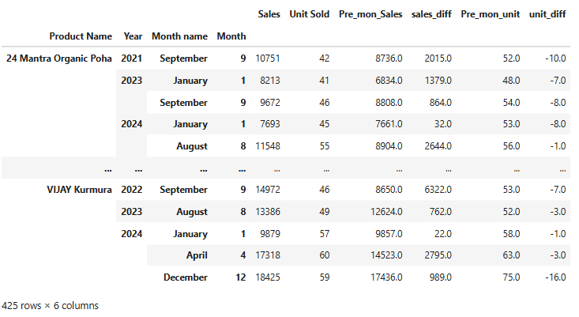

---

## <b> 📈 5. Trend & Cumulative Analysis

### <b> Q31 </b>

#### *Calculate cumulative company revenue month by month from January 2020 to December 2024.*

``` python

month_cumulative = rice.copy()

month_cum_Frame = pd.DataFrame(month_cumulative.groupby(["Year", "Month_Name", "Month"])["Sales"].sum())

month_cum_Frame = month_cum_Frame.sort_values(by=["Year", "Month"])

month_cum_Frame["cumulative"] = month_cum_Frame["Sales"].cumsum()

month_cum_Frame.head(25)

```

## 📷 Output

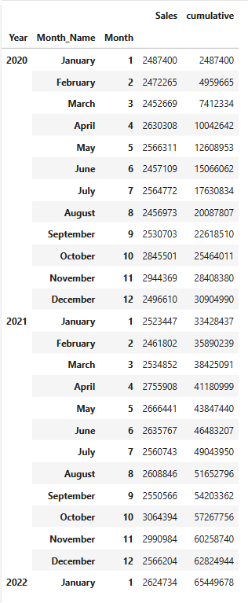

---

### <b> Q32 </b>

#### *Calculate cumulative gross profit for every location and compare long-term profitability.*

``` python

loc_cum = rice.copy()

loc_cum_frame = pd.DataFrame(loc_cum.groupby(["Location", "Year", "Month_Name", "Month"])["Profit"].sum())

loc_cum_frame = loc_cum_frame.sort_values(by=["Location", "Year", "Month"])

loc_cum_frame["Cumulative"] = loc_cum_frame.groupby("Location")["Profit"].cumsum()

value_filter = loc_cum_frame.xs((2024, "December"), level=("Year", "Month_Name"))

value_filter = value_filter.sort_values(by=["Cumulative"], ascending=False)

value_filter

```

## 📷 Output

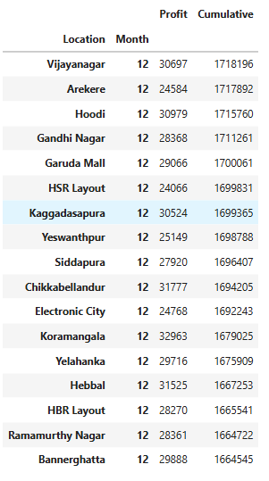

---

### <b> Q33 </b>

#### *Which product categories show a sustained upward revenue trend over the five-year period?*

``` python

year_sus = rice.copy()

year_sus_fra = pd.DataFrame(year_sus.groupby(["Product Category", "Year"])["Sales"].sum())

year_sus_fra["previous_year"] = year_sus_fra.groupby("Product Category")["Sales"].shift(1)

year_sus_fra["Diff"] = year_sus_fra["Sales"] - year_sus_fra["previous_year"]

year_sus_fra["Diff"] = year_sus_fra["Sales"] - year_sus_fra["previous_year"]

filter_val = year_sus_fra.groupby("Product Category")["Diff"].apply(lambda x : x.dropna().gt(0).all())

fil_index = filter_val[filter_val].index

year_sus_fra = year_sus_fra.reset_index()

year_sus_fra[year_sus_fra["Product Category"].isin(fil_index)]

```

## 📷 Output

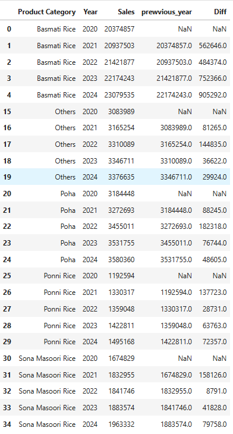

---

### <b> Q34 </b>

#### *Which product categories show a sustained decline in units sold?*

``` python

unit_sus = rice.copy()

unit_frame = pd.DataFrame(unit_sus.groupby(["Product Category", "Year"])["Unit Sold"].sum())

unit_frame = unit_frame.sort_values(by=["Product Category", "Year"])

unit_frame["pre year"] = unit_frame.groupby("Product Category")["Unit Sold"].shift(1)

unit_frame["Diff"] = unit_frame["Unit Sold"] - unit_frame["pre year"]

frame_filter = unit_frame.groupby(["Product Category"])["Diff"].apply(lambda x : x.dropna().lt(0).all())

frame_filter[frame_filter].index

unit_frame = unit_frame.reset_index()

unit_frame[unit_frame["Product Category"].isin(frame_filter)]

```

## 📷 Output

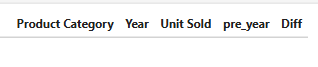

---

### <b> Q35 </b>

#### *Determine whether each brand's long-term revenue trend is growing, declining, or relatively stable.*

``` python

gro_dec_sta = rice.copy()

gro_frame = pd.DataFrame(gro_dec_sta.groupby(["Rice Brand", "Year"])["Sales"].sum())

gro_frame = gro_frame.sort_values(by=["Rice Brand", "Year"])

gro_frame["Pre_year"] = gro_frame.groupby("Rice Brand")["Sales"].shift(1)

gro_frame["Growth"] = ((gro_frame["Sales"] - gro_frame["Pre_year"]) / gro_frame["Pre_year"]) * 100

gro_frame["Growth"] = gro_frame["Growth"].apply(lambda x : f"{x :.2f} %")

gro_frame

```

## 📷 Output

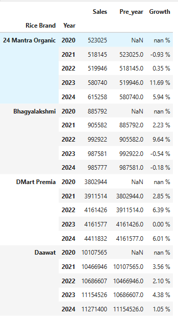

---

### <b> Q36 </b>

#### *Identify products that have experienced a major long-term change in sales performance.*

``` python

long_term = rice.copy()

long_term_frame = pd.DataFrame(long_term.groupby(["Product Name", "Year"])["Sales"].sum())

long_term_frame["Pre Year"] = long_term_frame.groupby("Product Name")["Sales"].shift(1)

long_term_frame["Diff"] = ((long_term_frame["Sales"] - long_term_frame["Pre Year"]) / long_term_frame["Pre Year"]) * 100

long_calculation = long_term_frame.groupby("Product Name")["Diff"].agg(["min", "mean", "max"])

long_calculation

```

## 📷 Output

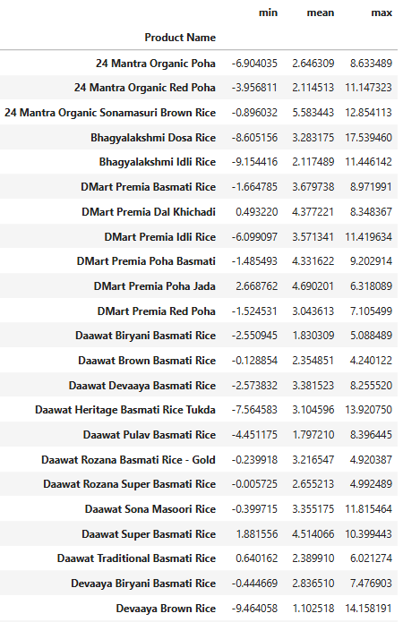

---

### <b> Q37 </b>

#### *Analyse how the revenue contribution of each product category changed from the beginning to the end of the five-year period.*

``` python

five_year_per = rice.copy()

five_frame = pd.DataFrame(five_year_per.groupby(["Year", "Product Category"])["Sales"].sum())

year_sum = five_frame.groupby("Year")["Sales"].sum()

year_sum = year_sum.reset_index()

five_frame = five_frame.reset_index()

five_frame["Total_sales"] = five_frame["Year"].map(year_sum.set_index("Year")["Sales"])

five_frame["contribution"] = (five_frame["Sales"] / five_frame["Total_sales"]) * 100

five_frame["contribution"] = five_frame["contribution"].apply(lambda x: f"{x :.2f} %")

five_frame

```

## 📷 Output

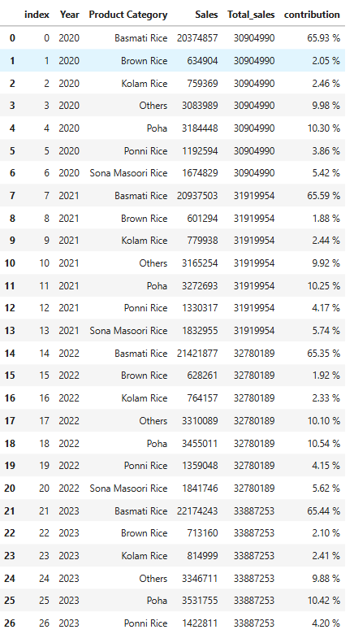

---

## <b> 📈 6. Rolling / Moving-Window Analysis

### <b> Q38 </b>

#### *Calculate the three-month rolling average of total revenue and use it to understand the underlying sales trend.*

```python

rolling_3 = rice.copy()

roll_frame = pd.DataFrame(rolling_3.groupby(["Year", "Month_Name", "Month"])["Sales"].sum())

roll_frame = roll_frame.sort_values(by=["Year", "Month"])

roll_frame["3_mon_roll"] = roll_frame["Sales"].rolling(3).mean()

pd.set_option("display.float_format", "{:,.0f}".format)

```

## 📷 Output

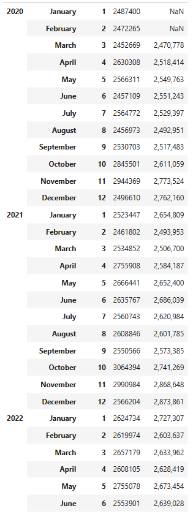

---

### <b> Q39 </b>

#### *Calculate a six-month rolling average of units sold for each product category.*

```python

six_mon_avg = rice.copy()

six_frame = six_mon_avg.groupby(["Product Category", "Year", "Month", "Month_Name"])["Unit Sold"].sum()

six_frame = six_frame.reset_index()

six_frame = six_frame.sort_values(by=["Product Category", "Year", "Month"])

six_frame["roll_avg"] = six_frame.groupby("Product Category")["Unit Sold"].transform(lambda x : x.rolling(6).mean())

six_frame["diff"] = six_frame.groupby("Product Category")["roll_avg"].shift(1)

six_frame["diff_cal"] = six_frame["roll_avg"] - six_frame["diff"]

six_frame["diff_cal_shift"] = six_frame.groupby("Product Category")["diff_cal"].shift(1)

sus_week = six_frame[(six_frame["diff_cal"] < 0) & (six_frame["diff_cal_shift"] < 0)]

```

## 📷 Output

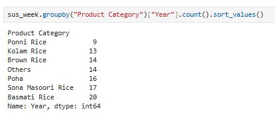

---

#### *Which categories show sustained weakness?*

### <b> Q40 </b>

#### *Calculate a three-month rolling revenue measure for every location.*

#### *Identify locations whose recent performance is below their normal trend.*

```python

loc_avg = rice.copy()

loc_frame = pd.DataFrame(loc_avg.groupby(["Location", "Year", "Month", "Month_Name"])["Sales"].sum())

loc_frame = loc_frame.sort_values(by=["Location", "Year", "Month"])

loc_frame["rolling_3"] = loc_frame.groupby("Location")["Sales"].transform(lambda x : x.rolling(3).mean().round())

loc_frame["shift_1"] = loc_frame.groupby("Location")["rolling_3"].shift(1)

loc_frame["diff"] = ((loc_frame["rolling_3"] - loc_frame["shift_1"]) / loc_frame["shift_1"]) * 100

loc_avg_total = loc_frame.groupby("Location")["diff"].mean()

loc_avg_total = loc_avg_total.reset_index()

loc_frame = loc_frame.reset_index()

loc_frame["loc_overall_avg"] = loc_frame["Location"].map(loc_avg_total.set_index("Location")["diff"])

result_cal = loc_frame[(loc_frame["Year"] == 2024) & (loc_frame["Month"] >= 10)]

result_cal["avg_segment"] = result_cal.apply(
    lambda row : "High_Performance" if row["diff"] > row["loc_overall_avg"] else "Low_Performance", axis=1
)

```

## 📷 Output

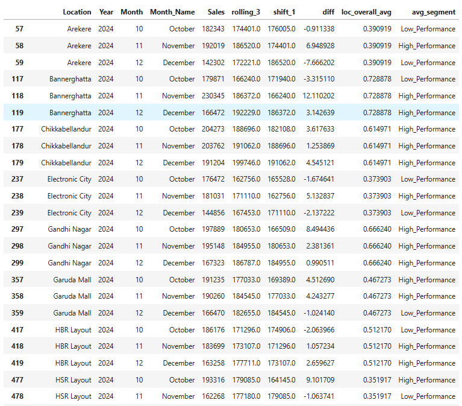

---

### <b> Q41 </b>

#### *Analyse the rolling gross profit of the major product categories and identify categories whose profitability is weakening.*

```python

pro_3 = rice.copy()

pro_frame = pd.DataFrame(pro_3.groupby(["Product Category", "Year", "Month", "Month_Name"])["Profit"].sum())

pro_frame = pro_frame.sort_values(by=["Product Category", "Year", "Month"])

pro_frame["roll_3"] = pro_frame.groupby("Product Category")["Profit"].transform(lambda x : x.rolling(3).mean().round())

year_avg = pd.DataFrame(pro_frame.groupby(["Product Category", "Year"])["roll_3"].mean().round())

year_avg["pro_shift"] = year_avg.groupby("Product Category")["roll_3"].shift(1)

year_avg["diff"] = year_avg["roll_3"] - year_avg["pro_shift"]

year_avg

```

## 📷 Output

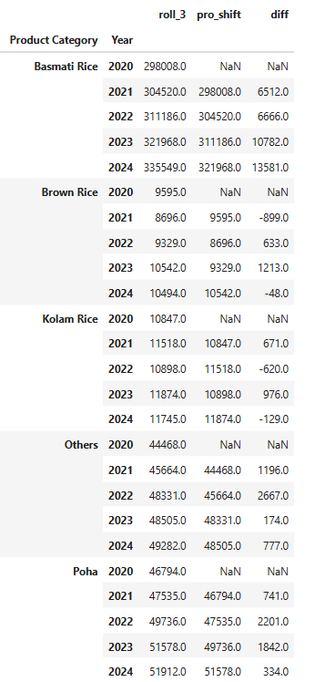

---

### <b> Q42 </b>

#### *Identify products whose recent three-month performance is significantly different from their longer-term performance.*

```python

long_term = rice.copy()

long_Frame = pd.DataFrame(long_term.groupby(["Product Name", "Year", "Month", "Month_Name"])["Sales"].sum())

long_Frame = long_Frame.sort_values(by=["Product Name", "Year", "Month"])

long_Frame["roll_avg"] = long_Frame.groupby("Product Name")["Sales"].transform(lambda x : x.rolling(3).mean().round())

total_avg = long_Frame.groupby("Product Name")["roll_avg"].mean().round()

total_avg = total_avg.reset_index()

long_Frame = long_Frame.reset_index()

long_Frame["pro_avg"] = long_Frame["Product Name"].map(total_avg.set_index("Product Name")["roll_avg"])

value_filter = long_Frame[(long_Frame["Year"] == 2024) & (long_Frame["Month"].isin([12]))].copy()

value_filter["growth"] = (((value_filter["roll_avg"] - value_filter["pro_avg"]) / value_filter["pro_avg"]) * 100).round()

positive_growth = value_filter[value_filter["growth"] >= 10]

positive_growth

```

## 📷 Output

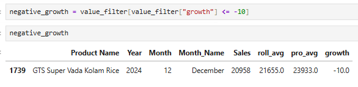

---

## <b> 📈 7. First & Latest Event Analysis

### <b> Q43 </b>

#### *For every product, identify its first recorded sales month and latest recorded sales month.*

```python

first_last = rice.copy()

first_last.groupby("Product Name")["Date"].agg(["min", "max"])

```

## 📷 Output

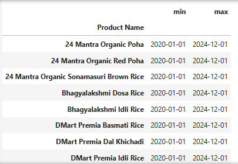

---

### <b> Q44 </b>

#### *For each brand, compare revenue in its first recorded month with revenue in its latest recorded month.*

```python

fir_las_com = rice.copy()

fir_las_com = fir_las_com.sort_values(["Rice Brand", "Date"])

res = fir_las_com.groupby("Rice Brand").agg(first_date = ("Date", "min"), last_date = ("Date", "max")).reset_index()

first_value = fir_las_com.loc[fir_las_com.groupby("Rice Brand")["Date"].idxmin(), ["Rice Brand", "Sales"]].rename(columns= {"Sales": "first_value"})

last_value = fir_las_com.loc[fir_las_com.groupby("Rice Brand")["Date"].idxmax(), ["Rice Brand", "Sales"]].rename(columns= {"Sales": "Last_value"})

res = res.merge(first_value, on= "Rice Brand")

res = res.merge(last_value, on= "Rice Brand")

res["difference"] = res["first_value"] - res["Last_value"]

res

```

## 📷 Output

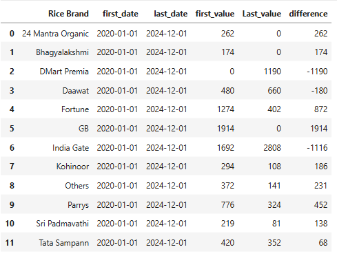

---

### <b> Q45 </b>

#### *For every location, determine the first and latest month in which sales were recorded.*

```python

location = rice.copy()

location = location.sort_values(["Location", "Date"])

filter_frame = location.groupby("Location")["Date"].agg(First_date = "min", Last_date = "max")

filter_frame

```

## 📷 Output

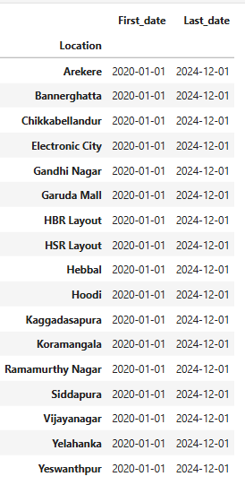

---

### <b> Q46 </b>

#### *For each product category, compare its performance during its first available period with its most recent period.*

```python

pro_cat = rice.copy()

pro_frame = pro_cat.groupby(["Product Category", "Date"])["Sales"].sum().reset_index()

first_date = pro_frame.groupby("Product Category").agg(first_date = ("Date", "min"))

last_date = pro_frame.groupby("Product Category").agg(last_date = ("Date", "max"))

first_value = first_date.merge(pro_frame,
    left_on= ["Product Category", "first_date"],
    right_on= ["Product Category", "Date"])["Sales"].sum().rename("first_value").reset_index()

last_value = last_date.merge(pro_frame,
    left_on= ["Product Category", "last_date"],
    right_on= ["Product Category", "Date"],
    how= "left").groupby(["Product Category", "Date"])["Sales"].sum().rename("last_value").reset_index()

last_value.drop(columns= ["Product Category"], inplace= True)

final = pd.concat([first_value,last_value], axis= 1)

final["diff"] = final["last_value"] - final["first_value"]

final

```

## 📷 Output

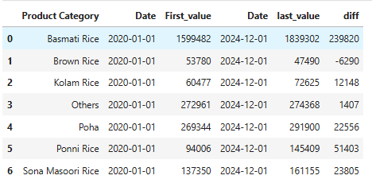

---

### <b> Q47 </b>

#### *Identify products that appeared early in the dataset but have very weak or zero activity in later periods.*

```python

three_mon = rice.copy()

three_first = three_mon.groupby(["Product Name", "Year", "Month", "Month Name"])["Sales"].sum().groupby(level= 0).head(3)

three_first = three_first.reset_index()

three_cont = three_first.groupby("Product Name")["Sales"].sum().reset_index()

three_last = three_mon.groupby(["Product Name", "Year", "Month", "Month Name"])["Sales"].sum().groupby(level= 0).tail(3)

three_last = three_last.reset_index()

three_last_cont = three_last.groupby("Product Name")["Sales"].sum().reset_index()

three_cont = three_cont.rename(columns= {"Sales": "first_3_month"})

three_last_cont = three_last_cont.rename(columns= {"Sales": "last_3_month"})

com_frame = three_cont.merge(three_last_cont, on= "Product Name", how= "left")

com_frame["difference"] = (com_frame["last_3_month"] / com_frame["first_3_month"]) * 100

com_frame["difference"] = com_frame["difference"].apply(lambda x : f"{x :.2f} %")

com_frame

```

## 📷 Output

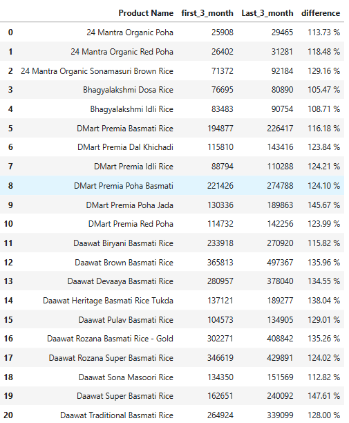

---

## <b> 📈 8. Previous & Next Event Analysis

### <b> Q48 </b>

#### *Calculate the change in monthly revenue for every location compared with its previous month.*

```python

change_month = rice.copy()

month_frame = change_month.groupby(["Location", "Year", "Month", "Month Name"])["Sales"].sum().reset_index()

month_frame["month_shift"] = month_frame.groupby(["Location"])["Sales"].shift(1)

month_frame["Difference"] = month_frame["Sales"] - month_frame["month_shift"]

month_frame

```

## 📷 Output

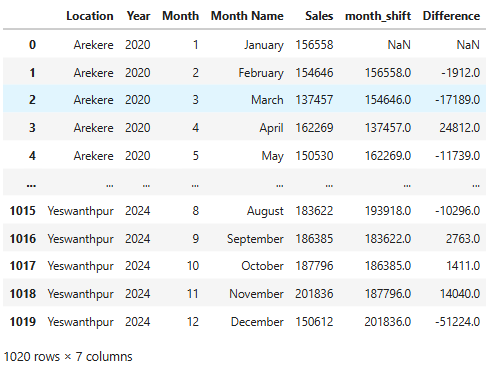

---

### <b> Q49 </b>

#### *For every product, calculate the change in units sold from the previous month.*

```python

unit_large_change = rice.copy()

unit_frame = unit_large_change.groupby(["Product Name", "Year", "Month", "Month Name"])["Unit Sold"].sum().reset_index()

unit_frame = unit_frame.sort_values(by=["Product Name", "Year", "Month"])

unit_frame["month_shift"] = unit_frame.groupby(["Product Name"])["Unit Sold"].shift(1)

unit_frame["difference"] = unit_frame["Unit Sold"] - unit_frame["month_shift"]

positive_changes = unit_frame[unit_frame["difference"] > 0].copy()

positive_changes["diff_seg"] = positive_changes["difference"].apply(
    lambda x: "large changes" if x > positive_changes["difference"].mean() else "Not"
)

positive_changes[positive_changes["diff_seg"] == "large changes"]

```

## 📷 Output


---

#### *Identify unusually large changes.*

### <b> Q50 </b>

#### *Identify product-location combinations where sales suddenly increased or decreased compared with the previous month.*

```python

pro_loc = rice.copy()

pro_frame = pro_loc.groupby(["Product Name", "Location", "Year", "Month", "Month Name"])["Sales"].sum().reset_index()

pro_frame = pro_frame.sort_values(by=["Product Name", "Location", "Year", "Month"])

pro_frame["shift"] = pro_frame.groupby(["Product Name", "Location"])["Sales"].shift(1)

pro_frame["Difference"] = pro_frame["Sales"] - pro_frame["shift"]

pro_frame["Difference"] = pro_frame["Difference"].abs()

pro_index = pro_frame.groupby(["Product Name", "Location"])["Difference"].mean().reset_index()

pro_index = pro_index.rename(columns={"Difference":"Month_Avg"})

pro_frame = pro_frame.merge(
    pro_index,
    on=["Product Name", "Location"],
    how="left"
)

pro_frame[pro_frame["Difference"] > pro_frame["Month_Avg"]]

```

## 📷 Output


---

### <b> Q51 </b>

#### *For each brand, calculate month-to-month revenue changes and identify periods of high volatility.*

```python

vol = rice.copy()

vol_frame = vol.groupby(["Rice Brand", "Year", "Month", "Month Name"])["Sales"].sum().reset_index()

vol_frame = vol_frame.sort_values(by=["Rice Brand", "Year", "Month"])

vol_frame["shift"] = vol_frame.groupby(["Rice Brand"])["Sales"].shift(1)

vol_frame["Diff"] = vol_frame["Sales"] - vol_frame["shift"]

vol_frame["Diff"] = vol_frame["Diff"].abs()

vol_frame["Growth"] = ((vol_frame["Sales"] - vol_frame["shift"]) / vol_frame["shift"]) * 100

vol_frame[vol_frame["Growth"] > 50]

```

## 📷 Output


---

### <b> Q52 </b>

#### *For every product, compare its current month with its previous month and identify the largest positive and negative movements.*

```python

pos_neg = rice.copy()

pos_frame = pos_neg.groupby(["Product Name", "Year", "Month", "Month Name"])["Sales"].sum().reset_index()

pos_frame["shift"] = pos_frame.groupby(["Product Name"])["Sales"].shift(1)

pos_frame["growth"] = ((pos_frame["Sales"] - pos_frame["shift"]) / pos_frame["shift"] * 100).round(2)

largest_positive = pos_frame[pos_frame["growth"] == pos_frame["growth"].max()]

largest_positive

```

## 📷 Output


---

## <b> 📈 9. Duplicate & Record-Quality Analysis

### <b> Q53 </b>

#### *Check whether the dataset contains exact duplicate records.*

```python

dup = rice.copy()

dup = dup.reset_index()

dup[dup.duplicated(keep= False)]

```

## 📷 Output


---

### <b> Q54 </b>

#### *Investigate whether multiple records exist for the same Date + Location + Product ID combination.*

#### *Determine whether those duplicates are legitimate or potentially problematic.*

```python

inv = rice.copy()

inv[inv.duplicated(subset= ["Date", "Location", "Product ID"], keep= False)]

```

## 📷 Output


---

### <b> Q55 </b>

#### *Check whether the same Product ID is associated with different product names, categories, brands, or package sizes.*

```python

pro_id = rice.copy()

check = pro_id.groupby("Product ID")[["Product Name", "Product Category", "Rice Brand", "Product Quantity"]].nunique()

check[(check > 1).any(axis= 1)]

```

## 📷 Output


---

### <b> Q56 </b>

#### *Identify products whose selling price changes across different locations or months.*

#### *Determine whether this appears to be a legitimate business variation or a data-quality issue.*

```python

three_level = rice.copy()

three_level.groupby(["Product Name", "Year", "Month", "Month Name", "Product Quantity"])["Unit Price"].nunique().reset_index()

```

## 📷 Output


```python

loc = three_level.groupby(["Product Name", "Location", "Product Quantity"])["Unit Price"].nunique().reset_index()

loc

```

## 📷 Output


```python

loc[(loc["Product Name"] == "24 Mantra Organic Poha") & (loc["Product Quantity"] == "1 kg")]

```

## 📷 Output


```python

loc[(loc["Product Name"] == "DMart Premia Poha Basmati") & (loc["Product Quantity"] == "5 kg")]

```

## 📷 Output


---

## <b> 📈 10. Segmentation & Classification Analysis

### <b> Q58 </b>

#### *Divide locations into High-, Medium-, and Low-revenue segments. Compare the characteristics of each group.*

```python

three_seg = rice.copy()

three_group = three_seg.groupby("Location")["Sales"].sum().reset_index()

three_group["share_per"] = (three_group["Sales"] / three_group["Sales"].sum()) * 100

three_group["revenue_partion"] = pd.qcut(
    three_group["Sales"],
    q=3,
    labels=["Low Revenue", "Medium Revenue", "High Revenue"]
)

three_group

pd.set_option('display.float_format', '{:.2f}'.format)

three_group.groupby("revenue_partion")["Sales"].agg(["count", "mean", "sum", "min", "max"])

```

## 📷 Output


---

### <b> Q59 </b>

#### *Divide products into four groups using sales volume and gross margin:*

#### *• High volume / High margin*

#### *• High volume / Low margin*

#### *• Low volume / High margin*

#### *• Low volume / Low margin*

#### *Identify the products in each group.*

```python

high_low = rice.copy()

cal_frame = high_low.groupby("Product Name")[["Sales", "Profit"]].sum().reset_index()

cal_frame["Sales_Volumn"] = cal_frame["Sales"].apply(lambda x : "High Volumn" if x > cal_frame["Sales"].mean() else "Low Volumn")

cal_frame["Gross_Margin"] = (cal_frame["Profit"] / cal_frame["Sales"]) * 100

cal_frame["Margin_Avg"] = cal_frame["Gross_Margin"].apply(lambda x : "High Margin" if x > cal_frame["Gross_Margin"].mean() else "Low Margin")

```

## 📷 Output


---

### <b> Q60 </b>

#### *Segment brands according to their contribution to total revenue and identify the strategically important brands.*

```python

brand_sta = rice.copy()

brand_frame = brand_sta.groupby("Rice Brand")["Sales"].sum()

brand_frame = brand_frame.reset_index()

brand_frame = brand_frame.sort_values(by=["Sales"], ascending=False)

brand_frame["Sales_cont"] = (brand_frame["Sales"] / brand_frame["Sales"].sum()) * 100

brand_frame["brand_segment"] = pd.qcut(
    brand_frame["Sales_cont"],
    q=3,
    labels=["Low_Sales", "Medium_Sales", "High_Sales"]
)

```

## 📷 Output


---

### <b> Q61 </b>

#### *Segment products based on their profitability and determine which segments deserve attention from management.*

```python

seg_pro = rice.copy()

seg_frame = seg_pro.groupby("Product Name")[["Sales", "Profit"]].sum().reset_index()

seg_frame = seg_frame.sort_values(by=["Profit"], ascending=False)

seg_frame["Profitability"] = (seg_frame["Profit"] / seg_frame["Sales"]) * 100

seg_frame["Profitability_segment"] = pd.qcut(
    seg_frame["Profitability"],
    q=3,
    labels=["Low_Profit", "Medium_Profit", "High_Profit"]
)

seg_frame

seg_cal = seg_frame.groupby("Profitability_segment", observed=False)["Profit"].agg(["count", "sum", "mean", "min", "max"])

seg_cal

```

## 📷 Output


---

### <b> Q62 </b>

#### *Segment package sizes based on their sales performance and determine which size has the strongest business contribution.*

```python

pack_size = rice.copy()

pack_frame = pack_size.groupby("Product Quantity")["Sales"].sum().reset_index()

pack_frame["contribution"] = (pack_frame["Sales"] / pack_frame["Sales"].sum()) * 100

pack_frame["segment"] = pd.qcut(
    pack_frame["contribution"],
    q=3,
    labels=["Low_Performance", "Medium_Performance", "High_Performance"]
)

pack_frame.sort_values(by=["contribution"], ascending=False)

```

## 📷 Output


---

## <b> 📈 11. Missing, Inactive & Gap Analysis

### <b> Q63 </b>

#### *Identify product-location combinations with zero sales in one or more months.*

```python

one_or_more = rice.copy()

one_cal = one_or_more.groupby(["Product Name", "Location", "Year", "Month", "Month Name", "Sales"]).agg(sales_count = ("Sales", "count"))

one_cal = one_cal.reset_index()

one_cal = one_cal.sort_values(by=["Product Name", "Location", "Year", "Month", "Month Name", "Sales"])

one_zero_filter = one_cal[one_cal["Sales"] == 0]

pro_loc_combo = one_zero_filter.groupby(["Product Name", "Location"])["sales_count"].count()

pro_loc_combo.reset_index()

```

## 📷 Output


---

### <b> Q64 </b>

#### *Identify products that had sales previously but later experienced multiple consecutive zero-sales months.*

```python

zero_month = rice.copy()

zero_month.head(2)

zero_cal = zero_month.groupby(["Product Name", "Year", "Month", "Month Name"])["Sales"].sum().reset_index()

zero_cal = zero_cal.sort_values(by=["Product Name", "Year", "Month"])

zero_cal[zero_cal["Sales"] == 0]

```

## 📷 Output


---

### <b> Q65 </b>

#### *Find locations where particular categories became inactive for extended periods.*

```python

loc_category = rice.copy()

loc_frame = loc_category.groupby(["Location", "Product Category", "Year", "Month", "Month Name"])["Sales"].sum().reset_index()

loc_frame = loc_frame.sort_values(by=["Location", "Product Category", "Year", "Month"])

loc_frame

loc_frame[loc_frame["Sales"] == 0]

ponni_rice = loc_frame[loc_frame["Product Category"] == "Ponni Rice"]

ponni_rice.reset_index()

ponni_rice.groupby("Year")["Sales"].sum()

```

## 📷 Output


---

### <b> Q66 </b>

#### *Identify product-location combinations with irregular sales activity and determine where further investigation is needed.*

```python

irregular_sales = rice.copy()

irregular_frame = irregular_sales.groupby(["Product Name", "Location", "Year", "Month", "Month Name"])["Sales"].sum().reset_index()

irregular_frame = irregular_frame.sort_values(by=["Product Name", "Location", "Year", "Month"])

irregular_frame["Previous_month"] = irregular_frame.groupby(["Product Name", "Location"])["Sales"].shift(1)

irregular_frame["Difference"] = irregular_frame["Sales"] - irregular_frame["Previous_month"]

positive_diff = irregular_frame[irregular_frame["Difference"] > 0].copy()

positive_diff["Positive_change"] = positive_diff["Difference"].apply(
    lambda x : "irregular_difference" if x > positive_diff["Difference"].mean() else "Normal"
)

positive_diff[positive_diff["Positive_change"] == "irregular_difference"]

```

## 📷 Output


---

### <b> Q67 </b>

#### *Identify months where one or more product categories had no recorded sales at a particular location.*

```python

category_loc_combo = rice.copy()

category_loc_combo.head(2)

category_frame = category_loc_combo.groupby(["Product Category", "Location", "Year", "Month", "Month Name"])["Sales"].sum().reset_index()

category_frame[category_frame["Sales"] == 0]

```

## 📷 Output


---

## <b> 📈 12. Cohort & Retention Analysis

### <b> Q68 </b>

#### *Identify each customer's first purchase month and create customer cohorts based on that month.*

```python

first_pur = cohort.copy()

first_pur.head(2)

first_id = first_pur.groupby(["Customer_ID", "Month", "Month Name", "Purchase_Date"])["Sales"].count().reset_index()

first_id = first_id.sort_values(by=["Customer_ID", "Month", "Month Name", "Purchase_Date"])

cohort_work = first_id.groupby(["Customer_ID"]).head(1)

cohort_work

cohort_work.groupby(["Month Name"])["Month"].count().reset_index().sort_values(by=["Month"], ascending=False)

```

## 📷 Output


---

### <b> Q69 </b>

#### *For customers acquired in each month, calculate how many returned and purchased again in the following month.*

```python

acquired = cohort.copy()

acquired["Month"] = acquired["Purchase_Date"].dt.month

min_one = acquired.groupby(["Customer_ID", "Purchase_Date"]).min().reset_index()

min_add = min_one.groupby("Customer_ID").head(1).copy()

min_add["Month_add"] = min_add["Month"] + 1

min_add = min_add.reset_index()

min_add = min_add[["Customer_ID", "Month_add", "Month"]]

both_table_merge = acquired.merge(min_add, on="Customer_ID", how="left")

before_dup = both_table_merge[both_table_merge["Month_x"] == both_table_merge["Month_add"]].copy()

before_dup.drop_duplicates(subset=["Customer_ID"], inplace=True)

before_dup.groupby("Month_y")["Customer_ID"].count().reset_index()

```

## 📷 Output


---

### <b> Q70 </b>

#### *Calculate 30-day, 60-day, and 90-day customer retention.*

```python

cal_90 = cohort.copy()

more_than_2 = cal_90.groupby("Customer_ID")["Purchase_Date"].count().reset_index().rename(columns={"Purchase_Date": "Cus_Count"})

filtered_customer = more_than_2[more_than_2["Cus_Count"] >= 2]

filtered_customer = filtered_customer.set_index("Customer_ID")

filtered_customer = filtered_customer.index

final_customer = cal_90[cal_90["Customer_ID"].isin(filtered_customer)]

first_order = final_customer.groupby("Customer_ID")["Purchase_Date"].min().reset_index().rename(columns={"Purchase_Date": "First_order"})

days_30 = first_order.copy()

days_30["30_days"] = days_30["First_order"] + pd.Timedelta(days=30)

days_30 = days_30.drop(columns=["First_order"])

final_customer = final_customer.merge(days_30, on="Customer_ID", how="left")

days_60 = first_order.copy()

days_60["60_days"] = days_60["First_order"] + pd.Timedelta(days=60)

days_60 = days_60.drop(columns=["First_order"])

final_customer = final_customer.merge(days_60, on="Customer_ID", how="left")

days_90 = first_order.copy()

days_90["90_days"] = days_90["First_order"] + pd.Timedelta(days=90)

days_90 = days_90.drop(columns=["First_order"])

final_customer = final_customer.merge(days_90, on="Customer_ID", how="left")

```

## 📷 Output


---

### <b> Q71 </b>

#### *Identify customers who made purchases in multiple months and calculate their repeat-purchase rate.*

```python

multiple_pur = cohort.copy()

cus_count = multiple_pur.groupby("Customer_ID")["Purchase_Date"].nunique().reset_index().rename(columns={"Purchase_Date": "cus_count"})

repeated_cus = cus_count[cus_count["cus_count"] > 1]

((repeated_cus["Customer_ID"].count() / cus_count["Customer_ID"].nunique()) * 100).round(2)

```

### <b> Q72 </b>

#### *Compare high-value repeat customers with one-time customers in terms of revenue contribution.*

```python

revenue_con = cohort.copy()

cus_cou = revenue_con.groupby("Customer_ID")["Purchase_Date"].count().reset_index(name="Cus_count")

cus_cal = cus_cou[cus_cou["Cus_count"] > 1]

cus_cal = cus_cal.set_index("Customer_ID")

cus_cal = cus_cal.index

rep_cus = revenue_con[revenue_con["Customer_ID"].isin(cus_cal)]

rep_mean_cal = rep_cus.groupby("Customer_ID")["Revenue"].sum().reset_index(name="Sales")

rep_mean_cal["High_value"] = rep_mean_cal["Sales"].apply(lambda x : "High_value" if x > rep_mean_cal["Sales"].mean() else "Not")

high_val_cal = rep_mean_cal[rep_mean_cal["High_value"] == "High_value"]

high_val = ((high_val_cal["Sales"].sum() / revenue_con["Revenue"].sum()) * 100).round(2)

one_time_cus = cus_cou[cus_cou["Cus_count"] <= 1]

one_time_cus = one_time_cus.set_index("Customer_ID")

one_time_cus = one_time_cus.index

one_time_value = revenue_con[revenue_con["Customer_ID"].isin(one_time_cus)]

one_time = ((one_time_value["Revenue"].sum() / revenue_con["Revenue"].sum()) * 100).round(2)

pd.DataFrame({
    "High_Value_Contribution": [high_val],
    "One_Time_Cus_Contribution": [one_time]
})

```

## 📷 Output


---

### <b> Q73 </b>

#### *Identify month-wise segments whose purchase frequency is increasing or declining over time.*

```python

month_wise = cohort.copy()

month_wise["Month_Name"] = month_wise["Purchase_Date"].dt.month_name()

month_wise["Month"] = month_wise["Purchase_Date"].dt.month

month_group = month_wise.groupby(["Month_Name", "Month"])["Customer_ID"].count().reset_index()

month_group = month_group.sort_values(by=["Month"])

month_group["Segment"] = pd.qcut(
    month_group["Customer_ID"],
    q=3,
    labels=["Low_Frequency", "Normal", "High_Frequency"]
)

month_group

```

## 📷 Output


---

## <b> 📈 13. Relationship & Cross-Entity Analysis

### <b> Q74 </b>

#### *Analyse the relationship between brand and location. Identify brands whose performance is concentrated in only a few locations.*

```python

brand_location = rice.copy()

brand_frame = brand_location.groupby(["Rice Brand", "Location"])["Sales"].sum().reset_index(name=("Total_Sales"))

brand_frame = brand_frame.sort_values(by=["Rice Brand", "Total_Sales"], ascending=False).reset_index()

brand_frame = brand_frame.drop(columns=["index"])

total_revenue = brand_location.groupby("Rice Brand")["Sales"].sum().reset_index(name=("Total_Revenue"))

total_revenue = total_revenue.sort_values(by=["Rice Brand", "Total_Revenue"], ascending=False).reset_index()

total_revenue = total_revenue.drop(columns=["index"])

growth_performance = brand_frame.merge(total_revenue, on="Rice Brand", how="left")

growth_performance["Growth"] = ((growth_performance["Total_Sales"] / growth_performance["Total_Revenue"]) * 100).round(2)

growth_performance.head(30)

gro = growth_performance.groupby(["Rice Brand", "Location"])["Total_Sales"].sum().reset_index()

gro = gro.sort_values(by=["Rice Brand", "Total_Sales"], ascending=False).groupby("Rice Brand").head(3)

gro

```

## 📷 Output


---

### <b> Q75 </b>

#### *Analyse the relationship between category and package size. Identify the dominant package size for each category.*

```python

pac_size = rice.copy()

pac_group = pac_size.groupby(["Product Category", "Product Quantity"])["Sales"].sum().reset_index(name=("Total_Sales"))

pac_group = pac_group.sort_values(by=["Product Category", "Total_Sales"], ascending=False)

category_sum = pac_group.groupby("Product Category")["Total_Sales"].sum().reset_index(name=("Product_sum"))

pac_group["Product_sum"] = pac_group["Product Category"].map(category_sum.set_index("Product Category")["Product_sum"])

pac_group["Sales_Contribution"] = ((pac_group["Total_Sales"] / pac_group["Product_sum"]) * 100).round(2)

pac_group

category_analysis = pac_group.groupby(["Product Category"]).head(1)

category_analysis.sort_values(by=["Product Quantity"])

category_analysis["Product Quantity"].value_counts().reset_index()

```

## 📷 Output


---

### <b> Q76 </b>

#### *Determine whether high-revenue locations also tend to have high gross margins.*

```python

loc_gross_margin = rice.copy()

sales_cal = loc_gross_margin.groupby("Location")["Sales"].sum().reset_index().sort_values(by=["Sales"], ascending=False)

sales_cal

profit_cal = loc_gross_margin.groupby("Location")["Profit"].sum().reset_index().sort_values(by=["Profit"], ascending=False)

profit_cal

profit_margin_cal = sales_cal.merge(profit_cal, on="Location", how="left")

profit_margin_cal["Profit_margin"] = ((profit_margin_cal["Profit"] / profit_margin_cal["Sales"]) * 100).round()

profit_margin_cal.sort_values(by=["Profit_margin"], ascending=False)

```

## 📷 Output


---

### <b> Q77 </b>

#### *Determine whether the brands that sell the largest number of units are also the brands generating the largest revenue.*

```python

brand_unit = rice.copy()

brand_unit_corr = brand_unit.groupby("Rice Brand")[["Unit Sold", "Sales"]].sum().sort_values(by=["Sales", "Unit Sold"], ascending=False)

brand_unit_corr

brand_unit_corr["Sales"].corr(brand_unit_corr["Unit Sold"])

```

## 📷 Output


---

### <b> Q78 </b>

#### *Analyse the relationship between selling price and units sold. Determine whether higher-priced products generally sell less.*

```python

high_price = rice.copy()

price_cal = high_price[["Unit Price", "Unit Sold"]].sort_values(by=["Unit Price"], ascending=False)

price_cal["Price_Segment"] = pd.qcut(price_cal["Unit Price"], q=3, labels=["Low_Price", "Medium_Price", "High_Price"])

price_cal

High_Price = price_cal[price_cal["Price_Segment"] == "High_Price"]

High_Price["Unit Price"].corr(High_Price["Unit Sold"])

Medium_Price = price_cal[price_cal["Price_Segment"] == "Medium_Price"]

Medium_Price["Unit Price"].corr(Medium_Price["Unit Sold"])

Low_Price = price_cal[price_cal["Price_Segment"] == "Low_Price"]

Low_Price["Unit Price"].corr(Low_Price["Unit Sold"])

price_cal["Unit Price"].corr(price_cal["Unit Sold"])

```

## 📷 Output


---

### <b> Q79 </b>

#### *Identify products that perform strongly in one location but poorly in another.*

```python

strong_poor = rice.copy()

str_poor_frame = strong_poor.groupby(["Location", "Product Name"])["Sales"].sum().reset_index(name=("Total_Sales"))

str_poor_frame = str_poor_frame.sort_values(by=["Location", "Total_Sales"], ascending=False)

location_mean = str_poor_frame.groupby("Location")["Total_Sales"].mean().reset_index(name=("Location Mean"))

location_mean = location_mean.set_index("Location")["Location Mean"]

str_poor_frame["loc_mean"] = str_poor_frame["Location"].map(location_mean)

str_poor_frame["Product_segment"] = np.where(
    str_poor_frame["Total_Sales"] >= str_poor_frame["loc_mean"], "Strong_Performance", "Poor_Performance"
)

strong_per = str_poor_frame[str_poor_frame["Product_segment"] == "Strong_Performance"]

poor_per = str_poor_frame[str_poor_frame["Product_segment"] == "Poor_Performance"]

str_pro_name = strong_per[["Location", "Product Name"]]

week_pro_name = strong_per[["Location", "Product Name"]]

comparision = strong_per.merge(poor_per, on="Product Name", how="inner")

comparision

```

## 📷 Output


---

### <b> Q80 </b>

#### *Identify categories that are highly dependent on a particular brand or package size.*

```python

high_dep = rice.copy()

brand_group = high_dep.groupby(["Product Category", "Rice Brand"])["Sales"].sum().reset_index(name=("Brand_Total"))

brand_group = brand_group.sort_values(by=["Product Category", "Brand_Total"], ascending=False)

brand_total = high_dep.groupby(["Product Category"])["Sales"].sum().reset_index(name=("Brand_Total"))

brand_total = brand_total.set_index("Product Category")["Brand_Total"]

brand_group["Product_total"] = brand_group["Product Category"].map(brand_total)

brand_group["Brand_Contribution"] = ((brand_group["Brand_Total"] / brand_group["Product_total"]) * 100).round(2)

brand_group

pack_group = high_dep.groupby(["Product Category", "Product Quantity"])["Sales"].sum().reset_index(name=("pack_total"))

pack_group = pack_group.sort_values(by=["Product Category", "pack_total"], ascending=False)

pack_group["Product_total"] = pack_group["Product Category"].map(brand_total)

pack_group["Pack_Contribution"] = ((pack_group["pack_total"] / pack_group["Product_total"]) * 100).round(2)

pack_group

```

## 📷 Output


---

## <b> 📈 14. Contribution & Share Analysis

### <b> Q81 </b>

#### *Calculate each product category's percentage contribution to total company revenue.*

```python

per_con = rice.copy()

per_con_cal = per_con.groupby("Product Category")["Sales"].sum().reset_index(name=("Pro_Total"))

per_con_cal["Pro_Contribution"] = (per_con_cal["Pro_Total"] / per_con_cal["Pro_Total"].sum() * 100).round(2)

per_con_cal["Pro_Contribution"] = per_con_cal["Pro_Contribution"].apply(lambda x : f"{x :.2f} %")

per_con_cal.sort_values(by=["Pro_Total"], ascending=False)

```

## 📷 Output


---

### <b> Q82 </b>

#### *Calculate each brand's percentage contribution to total revenue and total units sold. Compare the two.*

```python

com_two = rice.copy()

comparision_cal = com_two.groupby(["Rice Brand"])[["Sales", "Unit Sold"]].sum()

comparision_cal["Sales_Contribution"] = (comparision_cal["Sales"] / comparision_cal["Sales"].sum() * 100).round(2)

comparision_cal["Unit_Sold_Contribution"] = (comparision_cal["Unit Sold"] / comparision_cal["Unit Sold"].sum() * 100).round(2)

comparision_cal["difference"] = comparision_cal["Sales_Contribution"] - comparision_cal["Unit_Sold_Contribution"]

comparision_cal.sort_values(by=["difference"], ascending=False)

```

## 📷 Output


---

### <b> Q83 </b>

#### *Calculate every location's percentage contribution to company revenue.*

```python

loc_per = rice.copy()

loc_cal = loc_per.groupby("Location")["Sales"].sum().reset_index(name=("Total_Revenue"))

loc_cal["Revenue_Contribution"] = ((loc_cal["Total_Revenue"] / loc_cal["Total_Revenue"].sum()) * 100).round(2)

loc_cal.sort_values(by=["Revenue_Contribution"], ascending=False)

```

## 📷 Output


---

### <b> Q84 </b>

#### *For each month, determine the revenue contribution percentage of every product category.*

```python

pro_cat_month = rice.copy()

pro_cat_cal = pro_cat_month.groupby(["Year", "Month", "Month Name", "Product Category"])["Sales"].sum().reset_index(name=("Pro_Sales"))

total_sales = pro_cat_cal.groupby(["Year", "Month"])["Pro_Sales"].sum().reset_index(name=("Total_Sales"))

total_cal = pro_cat_cal.merge(total_sales, on=["Year", "Month"], how="left")

total_cal["Revenue_Contribution"] = ((total_cal["Pro_Sales"] / total_cal["Total_Sales"]) * 100).round(2)

total_cal = total_cal.sort_values(by=["Year", "Month", "Revenue_Contribution"], ascending=False)

total_cal["Revenue_Contribution"] = total_cal["Revenue_Contribution"].apply(lambda x : f"{x :.2f} %")

total_cal

```

## 📷 Output


---

### <b> Q85 </b>

#### *Calculate what percentage of total revenue is generated by the top 10 products.*

```python

top_10 = rice.copy()

top_10_group = top_10.groupby("Product Name")["Sales"].sum().reset_index(name=("Total_Sales"))

top_10_group["Sales_Contribution"] = ((top_10_group["Total_Sales"] / top_10_group["Total_Sales"].sum()) * 100).round(2)

top_10_Pro = top_10_group.sort_values(by=["Sales_Contribution"], ascending=False).head(10)

top_10_Pro

```

## 📷 Output


---

### <b> Q86 </b>

#### *Calculate the percentage contribution of each location to total gross profit.*

```python

profit_loc = rice.copy()

profit_cal = profit_loc.groupby("Location")["Profit"].sum().reset_index(name=("Location_Profit"))

profit_cal["Profit_Contribution"] = ((profit_cal["Location_Profit"] / profit_cal["Location_Profit"].sum()) * 100).round(2)

profit_cal = profit_cal.sort_values(by=["Profit_Contribution"], ascending=False)

profit_cal["Profit_Contribution"] = profit_cal["Profit_Contribution"].apply(lambda x : f"{x :.2f} %")

profit_cal

```

## 📷 Output


---

### <b> Q87 </b>

#### *Identify categories whose share of total revenue is increasing over time.*

```python

cat_over_time = rice.copy()

year_cal = cat_over_time.groupby(["Year", "Product Category"])["Sales"].sum().reset_index(name=("Total_Sales"))

pro_sum = year_cal.groupby("Year")["Total_Sales"].sum().reset_index(name=("Pro_Sum"))

pro_sum = pro_sum.set_index("Year")["Pro_Sum"]

year_cal["Pro_sum"] = year_cal["Year"].map(pro_sum)

year_cal["Pro_Contribution"] = ((year_cal["Total_Sales"] / year_cal["Pro_sum"]) * 100).round(2)

year_cal

```

## 📷 Output


---

## <b> 📈 15. Root-Cause & Drill-Down Analysis

### <b> Q88 </b>

#### *Management says:*

#### *"Overall revenue has declined in some months. Find out why."*

#### *Investigate the issue from:*

#### *Company → Location → Category → Brand → Product*

#### *Then identify the major contributors to the decline.*

```python


```

## 📷 Output


---


